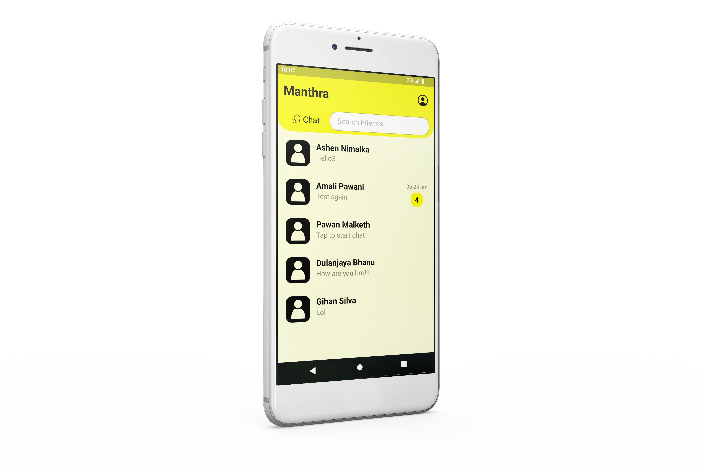

<br/>
<div align="center">
<a href="https://github.com/dulanjayabhanu/HelpHub2.0">

</a>
<h3 align="center">Manthra</h3>
<p align="center">
REACTNATIVE CHAT APPLICATION
<br/>
<br/>
<a href="https://github.com/dulanjayabhanu/HelpHub2.0"><strong>Explore the docs »</strong></a>
<br/>
<br/>
<a href="https://github.com/dulanjayabhanu/Manthra/">View Repo .</a>  
<a href="https://github.com/dulanjayabhanu/Manthra/issues/new?labels=bug&amp;template=bug_report.md">Report Bug .</a>
<a href="https://github.com/dulanjayabhanu/Manthra/issues/new?labels=enhancement&amp;&template=feature_request.md">Request Feature</a>
</p>
</div>

  

# Manthra

Welcome to Manthra 📱, a React Native chat application designed for personal chat conversations, finding new friends, and more. This project showcases my skills and passion for mobile app development and social connectivity.

<div>
  
</div>

## ✨ Features

- **User Registration and Authentication**: Create an account and log in securely 🔒.
- **Personal Chat**: Have private conversations with friends 💬.
- **Find New Friends**: Discover and connect with new people 🌍.
- **Profile Management**: Update your profile and password easily 🛠️.
- **Notifications**: Stay updated with notifications for new messages and activities 🔔.

## 💻 Technologies Used

- **React Native**: Frontend framework for building mobile applications.
- **PHP**: Backend scripting language.
- **MySQL**: Database management system.

## 🛠️ Installation

To set up this project locally, follow these steps:

1. **Clone the repository**
   ```bash
   git clone https://github.com/dulanjayabhanu/Manthra.git
   cd Manthra
2. **Install dependencies**
   ```bash
   npm install
3. **Set up the backend**
   - Ensure you have PHP and MySQL installed on your server.
   - Create a MySQL database for the project:
     ```bash
     CREATE DATABASE manthra_db;
   - Import the database schema from the database folder:
      ```bash
      USE manthra_db;
      SOURCE path_to_schema.sql;
4. Configure environment variables
   - Create a `.env` file in the root directory and add your database credentials and other environment variables.
5. Run the application
   ```bash
      npm start

## 🤝 Contributing

Contributions are what make the open-source community such an amazing place to learn, inspire, and create. Any contributions you make are **greatly appreciated**.

1. Fork the Project 🍴
2. Create your Feature Branch (`git checkout -b feature/AmazingFeature`) 🌟
3. Commit your Changes (`git commit -m 'Add some AmazingFeature'`) 💬
4. Push to the Branch (`git push origin feature/AmazingFeature`) 🚀
5. Open a Pull Request 📥

## 📜 License

Distributed under the Apache 2.0 License. See `LICENSE` for more information.

## 📧 Contact

Dulanjaya Bhanu - [Twitter](https://x.com/i/flow/login?redirect_after_login=%2FDulanjayaBhanu) - dulanjayawebs@gmail.com
Project Link: [https://github.com/dulanjayabhanu/Manthra](https://github.com/dulanjayabhanu/Manthra)
